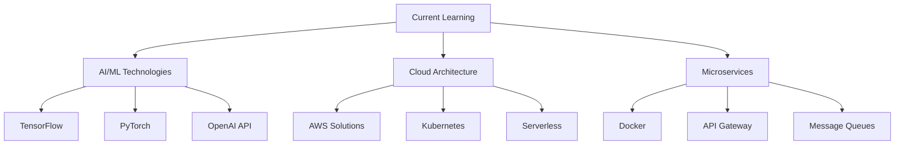

<div align="center">

# 👋 Hi there, I'm Kishoresharma


[](https://github.com/kishoresharmaks)
[](https://github.com/kishoresharmaks)
[](https://github.com/kishoresharmaks)

</div>

---

## 🚀 About Me

<div align="center">

```javascript
const kishoresharma = {
    pronouns: "He" | "Him",
    code: ["JavaScript", "TypeScript", "Python", "Java", "Go"],
    askMeAbout: ["Web Development", "Mobile Apps", "DevOps", "Cloud Computing"],
    technologies: {
        frontend: ["React", "Vue", "Angular", "Next.js", "HTML5", "CSS3"],
        backend: ["Node.js", "Express", "Django", "Spring Boot", "FastAPI"],
        database: ["MongoDB", "PostgreSQL", "MySQL", "Redis"],
        cloud: ["AWS", "Google Cloud", "Azure", "Docker", "Kubernetes"],
        mobile: ["React Native", "Flutter", "Ionic"]
    },
    funFact: "I turn coffee into code ☕ → 💻",
    currentFocus: "Building scalable web applications and exploring AI/ML"
};
```

</div>

---

## 📊 GitHub Analytics

<div align="center">


</div>

<div align="center">


</div>

---

## 🛠️ Tech Stack & Tools

<div align="center">

### Languages


### Frontend


### Backend


### Databases


### Cloud & DevOps


</div>

---

## 📈 GitHub Activity

<div align="center">


</div>

---

## 🎯 Current Focus

<div align="center">



</div>

---

## 📝 Latest Blog Posts

<div align="center">

[](https://nexusnation.in)

</div>

---

## 🏆 GitHub Trophies

<div align="center">

[](https://github.com/ryo-ma/github-profile-trophy)

</div>

---

## 📊 Contribution Stats

<div align="center">


</div>

---

## 🤝 Let's Connect!

<div align="center">

[](https://nexusnation.in)
[](https://github.com/kishoresharmaks)
[](https://linkedin.com/in/kishoresharmaks)
[](https://twitter.com/kishoresharmaks)
[](mailto:kishoresharma@example.com)

</div>

---

## 💡 Fun Facts

<div align="center">


</div>

---

<div align="center">

### 🎉 Thanks for visiting my profile!


**⭐ Star some repositories if you find them interesting!**

</div>