<div align="center">

# Hi there, I'm Kishoresharma! 👋


</div>

---

<div align="center">

## 🚀 About Me

</div>


```javascript
const kishoresharma = {
    pronouns: "He/Him",
    code: ["JavaScript", "Python", "Java", "C++", "HTML/CSS"],
    askMeAbout: ["web dev", "tech", "app dev", "software architecture"],
    technologies: {
        frontEnd: {
            js: ["React", "Vue", "Angular"],
            css: ["Bootstrap", "Tailwind", "Sass"]
        },
        backEnd: {
            js: ["Node", "Express"],
            python: ["Django", "Flask", "FastAPI"],
            java: ["Spring Boot"]
        },
        databases: ["MongoDB", "MySQL", "PostgreSQL", "Redis"],
        devOps: ["Docker", "Kubernetes", "AWS", "CI/CD"],
        tools: ["Git", "VS Code", "Postman", "Figma"]
    },
    currentFocus: "Building scalable web applications",
    funFact: "I debug with console.log() and I'm not ashamed! 😄"
};
```

<div align="center">

---

## 🛠️ Tech Stack & Tools

<p>


</p>

<p>


</p>

---

## 📊 GitHub Analytics

<p align="center">


</p>

<div align="center">

</div>

---

## 🏆 GitHub Trophies

<p align="center">

</p>

---

## 📈 Activity Graph


---

## 🎯 Current Focus

```mermaid
graph LR
    A[🔍 Learning] --> B[🚀 Building]
    B --> C[🤝 Collaborating]
    C --> D[📚 Sharing]
    D --> A
    
    style A fill:#ff6b6b
    style B fill:#4ecdc4
    style C fill:#45b7d1
    style D fill:#96ceb4
```

<div align="center">



</div>

- 🔭 Currently working on **scalable web applications**
- 🌱 Learning **cloud technologies** and **microservices architecture**
- 👯 Looking to collaborate on **open source projects**
- 💬 Ask me about **web development, software architecture, and tech trends**
- 📝 I regularly write articles on [nexusnation.in](https://nexusnation.in)

---

## 📫 Let's Connect!

<div align="center">

<a href="https://nexusnation.in" target="_blank">

</a>
<a href="https://github.com/kishoresharmaks" target="_blank">

</a>
<a href="mailto:your-email@example.com" target="_blank">

</a>

</div>

---

<div align="center">

### 💼 Open for Opportunities


**Interested in collaborating or have an exciting opportunity?**  
Feel free to reach out! I'm always open to discussing new projects and ideas.

---


### Show some ❤️ by starring some repositories!

</div>

---

<div align="center">

</div>